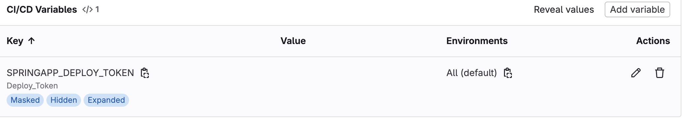
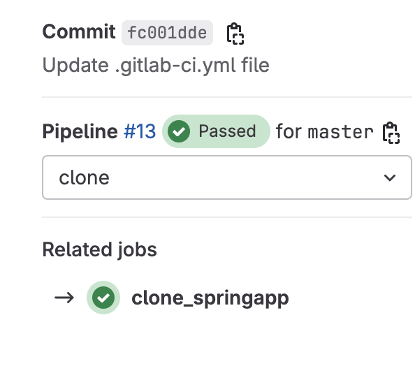

# Ejercicios

## Ejercicios GitLab

### 1. CI/CD de una aplicación spring - OBLIGATORIO

Dentro de esta carpeta hay una que se llama ejercicio_1, ahí es donde está el `.gitlab-ci.yaml`, En este caso, me daba un error la aplicación en sí, pero todos los jobs funcionaban y se ejecutaban correctamente, voy a poner aquí el pipeline junto con las imagenes funcionando correctamente, en el ejercicio pone que hay que comprobar la ejecución en el `http://localhost:8080` en mi caso es `http://localhost:8082`

Error de aplicación, pero arrancada:


Deploy token y variable



### 2. Crear un usuario nuevo y probar que no puede acceder al proyecto anteriormente creado - OBLIGATORIO

* Añadirlo con el role `guest`, comprobar que acciones puede hacer.
* Cambiar a role `reporter`, comprobar que acciones puede hacer.
* Cambiar a role `developer`, comprobar que acciones puede hacer.
* Cambiar a role `maintainer`, comprobar que acciones puede hacer.

Acciones a probar:

* Commit
* Ejecutar pipeline manualmente
* Push and pull del repo
* Merge request
* Acceder a la administración del repo

### 3. Crear un nuevo repositorio, que contenga una pipeline, que clone otro proyecto, springapp anteriormente creado - OPCIONAL
  
* **Con el método de CI job token**

  Este ejercicio lo he puesto dentro del `ejercicio_3/token`, tiene un fichero `.gitlab-ci.yml` con el caso en concreto usando el Token que he creado previamente como una variable en gitlab.


Pipeline funcionando:



> Pista: https://docs.gitlab.com/ee/ci/jobs/ci_job_token.html

* **Con el método deploy keys**

 Para este ejercicio he creado una clave ssh en concreto usando este commando:
```bash
 ssh-keygen -t rsa -b 4096 -C "deploy-key" -f springapp-deploy-key
```

Luego he añadido la clave pública en deploys keys dentro del repo de `springapp` y he puesto la clave privada como variable de entorno en el proyecto de `springapp-clone`, (normalmente esto no es una buena práctica, habría que usar hashicorp vault o alguna herramienta externa para ocultar estos datos)


Aquí hay una imagen del pipeline funcionando:


