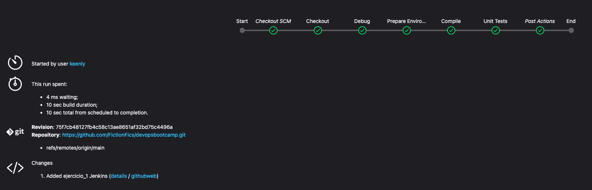
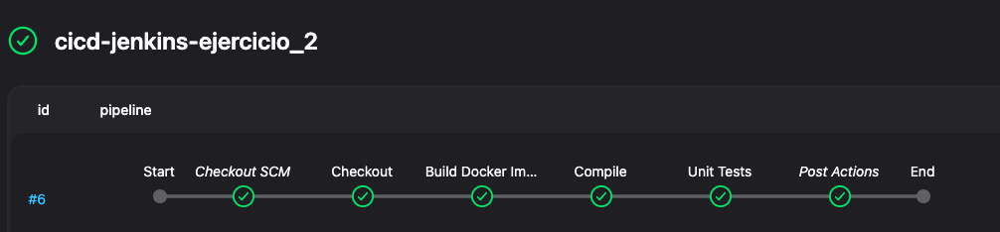
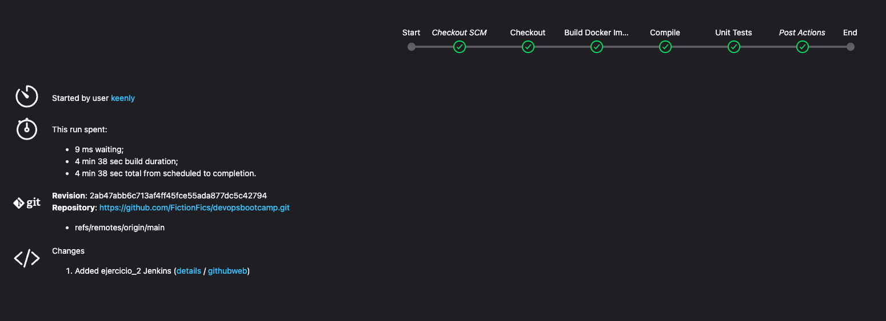

## Ejercicios Jenkins

### 1. CI/CD de una Java + Gradle - OBLIGATORIO

Esta parte del ejercicio se encuentra en `ejercicio_1/jenkins-resources` dentro de la carpeta `calculator` he creado el Jenkinsfile con distintos valores, una cosa a considerar es que la versión de Java de Jenkins es la 17 y la que está ejecutando Gradle era la 8, y daba un fallo de versión al ejecutar el compilar Java, he tenido que cambiar en el fichero `gradle-wrapper.properties` el distributionURL, adjunto una foto del pipeline funcionando.

### 2. Modificar la pipeline para que utilice la imagen Docker de Gradle como build runner - OBLIGATORIO

Esta parte del ejercicio se encuentra en `ejercicio_2`  he creado el Jenkinsfile donde realiza un build de la imagen que he puesto también en esta carpeta `gradle.Dockerfile`, realiza todos los pasos anteriores después de realizar el build de la imagen mencionada en el enunciado. Adjunto una imagen de el pipeline funcionando correctamente.

